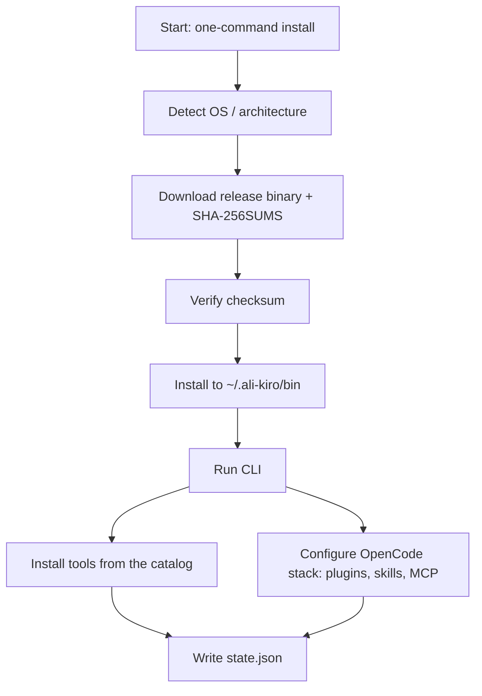

<!-- meta description: ali-kiro is a free, one-command cross-platform installer and manager for AI coding assistants — OpenCode, Claude Code, OpenAI Codex, Cursor, Aider, and Gemini CLI — with 38 bundled skills, 5 OpenCode plugins, and MCP server presets. Install from a single line on macOS, Linux, or Windows. -->

# ali-kiro

One-command, cross-platform installer and manager for AI coding assistants — OpenCode, Claude Code, Codex CLI, Cursor, Aider, and Gemini CLI.

Run one line on **macOS, Windows, or Linux** — `curl -fsSL … | bash` or `irm … | iex` — and ali-kiro downloads, installs, and verifies the six most popular AI coding tools, then configures a complete, production-grade **OpenCode stack**: merged settings, **5 plugins** (including oh-my-opencode-slim), **38 skills**, and **10 MCP server presets**. No manual setup, no permissions gymnastics.

[](https://github.com/alisattorov06/ali-kiro/actions/workflows/ci.yml) [](LICENSE) [](https://nodejs.org) [](docs/COMPATIBILITY.md) [](https://github.com/alisattorov06/ali-kiro/releases) [](https://github.com/alisattorov06/ali-kiro)

---

## Install

| Method | Command |
|--------|---------|
| **One-liner — macOS / Linux** | `curl -fsSL https://raw.githubusercontent.com/alisattorov06/ali-kiro/main/install.sh \| bash` |
| **One-liner — Windows (PowerShell)** | `irm https://raw.githubusercontent.com/alisattorov06/ali-kiro/main/install.ps1 \| iex` |
| **npm registry** (when published) | `npm install -g ali-kiro` |
| **From source** (Node.js ≥ 18) | `git clone https://github.com/alisattorov06/ali-kiro && cd ali-kiro && node ali-kiro.mjs` |

### One-liner (recommended)

**macOS / Linux** (bash):

```bash
curl -fsSL https://raw.githubusercontent.com/alisattorov06/ali-kiro/main/install.sh | bash
```

**Windows** (PowerShell):

```powershell
irm https://raw.githubusercontent.com/alisattorov06/ali-kiro/main/install.ps1 | iex
```

The installer downloads the architecture-matched prebuilt binary into
`~/.ali-kiro/bin/`, verifies it against `SHA-256SUMS` when available, and
launches ali-kiro. If no matching binary has been released yet (or execution
fails), it automatically falls back to running `node ali-kiro.mjs` from a
source checkout — and even auto-installs Node.js LTS if needed. Each release
ships the binary together with an assets archive (`ali-kiro-assets.tar.gz`)
that the one-liners automatically download and extract beside the binary; set
`ALI_KIRO_ASSETS` to override where assets are loaded from.

### GitHub Releases binary

Download the prebuilt binary for your platform from the
[latest release](https://github.com/alisattorov06/ali-kiro/releases/latest), make it
executable, and run it. No Node.js required.

| Platform | Asset | Command |
|----------|-------|---------|
| Linux x64 | `ali-kiro-linux-x64` | `chmod +x ali-kiro-linux-x64 && ./ali-kiro-linux-x64` |
| Linux arm64 | `ali-kiro-linux-arm64` | `chmod +x ali-kiro-linux-arm64 && ./ali-kiro-linux-arm64` |
| macOS x64 | `ali-kiro-macos-x64` | `chmod +x ali-kiro-macos-x64 && ./ali-kiro-macos-x64` |
| macOS arm64 | `ali-kiro-macos-arm64` | `chmod +x ali-kiro-macos-arm64 && ./ali-kiro-macos-arm64` |
| Windows x64 | `ali-kiro-windows-x64.exe` | `.\ali-kiro-windows-x64.exe` |
| Windows x64 (zip) | `ali-kiro-windows-x64.zip` | unzip → run `ali-kiro.exe` (self-contained, with `assets/` included) |

Direct links:
[linux-x64](https://github.com/alisattorov06/ali-kiro/releases/latest/download/ali-kiro-linux-x64) ·
[linux-arm64](https://github.com/alisattorov06/ali-kiro/releases/latest/download/ali-kiro-linux-arm64) ·
[macos-x64](https://github.com/alisattorov06/ali-kiro/releases/latest/download/ali-kiro-macos-x64) ·
[macos-arm64](https://github.com/alisattorov06/ali-kiro/releases/latest/download/ali-kiro-macos-arm64) ·
[windows-x64](https://github.com/alisattorov06/ali-kiro/releases/latest/download/ali-kiro-windows-x64.exe) ·
[windows-x64.zip](https://github.com/alisattorov06/ali-kiro/releases/latest/download/ali-kiro-windows-x64.zip) ·
[assets tarball](https://github.com/alisattorov06/ali-kiro/releases/latest/download/ali-kiro-assets.tar.gz)

Every release also publishes a `SHA-256SUMS` file for verification.

### npm registry (when published)

Once published to the public npm registry:

```bash
npm install -g ali-kiro
ali-kiro
```

### From source (Node.js ≥ 18)

```bash
git clone https://github.com/alisattorov06/ali-kiro
cd ali-kiro
node ali-kiro.mjs
```

Nothing to build — `ali-kiro.mjs` runs directly on any Node.js ≥ 18. From a
source checkout you can also run the test suite and build the binary yourself:

```bash
npm test                 # runs node --test test/
bun build --compile ali-kiro.mjs --outfile ali-kiro   # optional: build the binary
```

---

## Quick demo

```console
$ node ali-kiro.mjs --list
AI coding assistants known to ali-kiro:
TOOL         STATUS        VERSION           VERIFY COMMAND
opencode     installed     2.0.24            opencode --version
claude-code  not installed —                 claude --version
codex        not installed —                 codex --version
cursor       not installed —                 cursor --version
aider        not installed —                 aider --version
gemini       not installed —                 gemini --version

Use --only <id1,id2> / --skip <id1> to filter, --yes for non-interactive, --dry-run to preview.
```

```console
$ node ali-kiro.mjs --dry-run --target /tmp/ak-readme-dry
ali-kiro installer — linux/x64 · node v24.21.0 · DRY RUN (nothing will be changed)
▸ [1/7] Environment check: OS/arch, package managers, assets integrity
Platform: linux/x64 · package managers: npm, bun, brew, pip, curl, wget
Assets: config 3/3 · plugins 5 · skills 38 · mcp present
✔ Environment OK.
▸ [2/7] AI selection: menu (TTY) or --only/--skip filters (default: all 6)
Selected 6 tool(s): opencode, claude-code, codex, cursor, aider, gemini
▸ [3/7] OpenCode full stack: config, plugins+deps+smoke, skills, MCP, service
…
▸ [7/7] Final report + dry-run summary + exit code
DRY-RUN COMPLETE — no changes were made. Re-run without --dry-run to apply.
Errors: 0   Warnings: 0
```

---

## What it does

Run ali-kiro once and it:

- **Installs and verifies 6 assistants — OpenCode, Claude Code, Codex CLI,
  Cursor, Aider, and Gemini CLI** — picking the right install method for each
  OS (npm, brew, pip, cask, AppImage) and confirming each tool actually works
  afterwards with its `--version` check.
- **OpenCode deep-install** — merges global settings (`opencode.json`),
  installs **5 plugins** (FlowDeck, harness-memory, oh-my-opencode-slim,
  opencode-dynamic-context-pruning, opencode-snip), **38 skills** across
  proven groups, and syncs **10 MCP server presets** (6 auto-configured, 4
  flagged for a quick manual touch such as adding your GitHub token).
- **Keeps a state ledger** at `~/.ali-kiro/state.json` — the single source of
  truth for what is installed, which version, and whether it verified.
- **Is fully idempotent** — re-run it any time; already-installed tools are
  skipped, only missing or outdated pieces are touched.
- **Supports dry-run** — `ali-kiro --dry-run` shows the exact plan without
  changing anything, so you can preview before you commit.

Under the hood, ali-kiro ships as a small zero-dependency Node.js CLI
(`ali-kiro.mjs`) and as self-contained compiled binaries built with Bun
(no Node.js required).

---

## How it works



1. **Environment check** — detect OS/arch, available package managers, and
   verify bundled assets integrity.
2. **AI selection** — interactive menu (TTY) or `--only`/`--skip` filters;
   defaults to all 6 tools.
3. **OpenCode full stack** — copy config, install 5 plugins with deps +
   import-smoke, copy 38 skills, sync MCP servers, restart the service.
4. **Other AI assistants** — install + verify each selected tool (OpenCode,
   Claude Code, Codex CLI, Cursor, Aider, Gemini CLI).
5. **Verification sweep** — re-check every binary `--version`, plugin smokes,
   and the MCP list.
6. **Report + state write** — write `~/.ali-kiro/state.json` atomically.
7. **Final report** — per-tool status summary and exit code (`--dry-run`
   prints the plan without changing anything).

---

## Supported tools

| Tool | macOS | Windows | Linux | Verify |
|------|-------|---------|-------|--------|
| **OpenCode** | `curl -fsSL https://opencode.ai/install \| bash` | `irm https://opencode.ai/install.ps1 \| iex` | `curl -fsSL https://opencode.ai/install \| bash` | `opencode --version` |
| **Claude Code** | `npm install -g @anthropic-ai/claude-code` | `npm install -g @anthropic-ai/claude-code` | `npm install -g @anthropic-ai/claude-code` | `claude --version` |
| **OpenAI Codex** | `npm install -g @openai/codex` | `npm install -g @openai/codex` | `npm install -g @openai/codex` | `codex --version` |
| **Cursor** | `brew install --cask cursor` | [cursor.com](https://www.cursor.com) installer | AppImage from [cursor.com](https://www.cursor.com) | `cursor --version` |
| **Aider** | `python -m pip install aider-install && aider-install` | `python -m pip install aider-install && aider-install` | `python -m pip install aider-install && aider-install` | `aider --version` |
| **Gemini CLI** | `npm install -g @google/gemini-cli` | `npm install -g @google/gemini-cli` | `npm install -g @google/gemini-cli` | `gemini --version` |

ali-kiro runs the appropriate command per OS, then verifies each tool with its
`--version` check. Failures are reported in the final summary — nothing fails
silently.

---

## Why ali-kiro?

The official installers are excellent at installing their own tool. ali-kiro
sits on top of them so you get the whole workspace in one go:

| | ali-kiro | Installing each tool manually |
|---|---|---|
| **One command for 6 tools** | ✅ one line on macOS, Windows, or Linux | ❌ six separate installers, six docs pages |
| **Built-in verification** | ✅ every tool checked with `--version` after install | ❌ you find broken installs later |
| **OpenCode stack configured** | ✅ 5 plugins + 38 skills + 10 MCP presets merged for you | ❌ hand-wiring `opencode.json` and plugin dirs |
| **Idempotent re-runs** | ✅ converges — re-run anytime, no duplicates | ❌ manual maintenance per tool |
| **Single state ledger** | ✅ `~/.ali-kiro/state.json` knows what/version/verified | ❌ nothing tracks your setup |

---

## Quickstart

```bash
ali-kiro --list                          # show what's installed and what's missing
ali-kiro                                 # interactive menu — pick tools to install
ali-kiro --yes                           # install everything, no prompts
ali-kiro --dry-run                       # preview the plan; changes nothing
ali-kiro --only opencode                 # install just one tool (+ its OpenCode stack)
ali-kiro --target ~/ali-kiro-test        # install into an isolated dir (testing)
```

Afterwards, **restart OpenCode** once so it picks up the new plugins, skills,
and MCP servers.

---

## What gets installed for OpenCode

| Item | Detail |
|------|--------|
| Config | Merged global settings (`opencode.json`), CLI preferences (`cli.json`), and the dcp plugin schema (`dcp.jsonc`) |
| Plugins | 5 plugins, installed via portable relative paths (see table below) |
| Skills | 38 skills installed into your OpenCode skills directory |
| MCP servers | 10 presets — 6 auto-configured, 4 require a quick manual step |

### Plugins

| Plugin | Version | Purpose |
|--------|---------|---------|
| `oh-my-opencode-slim` | 3.0.3 | Slimmed oh-my-opencode skill/agent/command suite for OpenCode |
| `FlowDeck` | 0.7.0 | Structured planning, review, execute, verify, done workflows |
| `harness-memory` | 0.5.1 | Persistent memory harness with built-in secret scanning |
| `opencode-dynamic-context-pruning` | 3.2.0 | Dynamic context pruning to keep long sessions affordable |
| `opencode-snip` | git-main | `snip` command prefix to cut LLM token consumption |

### Skills (38)

- **19 from [anthropics/skills](https://github.com/anthropics/skills)** — the
  official Claude skill collection (`docx`, `pdf`, `pptx`, `xlsx`,
  `skill-creator`, `docs`, `canvas-design`, and more).
- **2 from [kdcokenny/opencode-workspace](https://github.com/kdcokenny/opencode-workspace)** —
  `code-review` and `code-philosophy`.
- **17 from the MiniMax skill suite** — platform build guides
  (`minimax-android-native-dev`, `minimax-flutter-dev`,
  `minimax-react-native-dev`, `minimax-ios-application-dev`, frontend,
  fullstack, shader, vision-analysis) and media generation (`minimax-minimax-docx`,
  pdf, xlsx, pptx, music, stickers, and more).

### MCP server presets

| Server | Purpose | Setup |
|--------|---------|-------|
| `context7` | LLM-friendly documentation lookup for any library | ✅ auto |
| `gh_grep` | Global code search (grep.app) | ✅ auto |
| `websearch` | Live web search via Exa | ✅ auto (may need `EXA_API_KEY`) |
| `memory` | Persistent agent memory (`mcp-server-memory`) | ✅ auto |
| `sequentialThinking` | Structured multi-step reasoning | ✅ auto |
| `playwright` | Browser automation | ✅ auto |
| `github` | GitHub API access | ⚠️ manual — add `Authorization: token <GITHUB_TOKEN>` header |
| `tokenOptimizer` | Token compression (native `better-sqlite3`) | ⚠️ manual — may need `npm rebuild better-sqlite3` |
| `grep_app` | De-duplicated grep.app entry | ⚠️ manual |
| `magic` | Developer utility MCP | ⚠️ manual |

The state ledger (`~/.ali-kiro/state.json`) records everything ali-kiro
installs, so re-runs converge instead of duplicating work.

---

## FAQ

**Is it safe to re-run ali-kiro?**
Yes. Every step is idempotent: already-installed tools are detected and
skipped, and the state ledger at `~/.ali-kiro/state.json` keeps re-runs fast
and deterministic.

**What if I don't have Node.js?**
The prebuilt binary needs no Node.js at all. If only the source path is
available (e.g. right after a release that has no binary yet), the installer
auto-installs Node.js LTS (`brew install node` / NodeSource / `winget install
OpenJS.NodeJS.LTS`, depending on your OS).

**How do the manual MCP servers work?**
The `github` preset needs an `Authorization: token <GITHUB_TOKEN>` header —
ali-kiro never hardcodes credentials. `tokenOptimizer` uses a native
`better-sqlite3` binding; if it fails to start on your system, rebuild it:
`cd ~/.npm/_npx/<dir> && npm rebuild better-sqlite3`. See
[docs/TROUBLESHOOTING.md](docs/TROUBLESHOOTING.md).

**Do I need to restart OpenCode after installing?**
Yes — restart OpenCode (quit and relaunch) so it picks up the new plugins,
38 skills, and MCP servers.

**Which platforms are supported?**
Linux x64/arm64, macOS x64/arm64, and Windows x64. See
[docs/COMPATIBILITY.md](docs/COMPATIBILITY.md) for the full matrix and known
gaps (e.g. Cursor's Linux AppImage doesn't register a CLI on PATH).

**Why another installer when I can run the official installers?**
One command installs and verifies all six assistants instead of juggling six
different installers. On top of that you get built-in verification, a state
ledger at `~/.ali-kiro/state.json`, and a fully configured OpenCode stack
(5 plugins, 38 skills, 10 MCP presets) — official installers stop at their
own binary.

---

## License

[MIT](LICENSE) — © 2026 Ali Kiro Project Authors.

---

## CREDITS

ali-kiro builds on and bundles the work of many excellent open-source projects.
Every upstream source is credited here; bundled code retains its original
licenses in `src/assets/`.

| Project | URL | Purpose | License |
|---------|-----|---------|---------|
| **OpenCode** (sst) | https://github.com/sst/opencode | The AI coding assistant that ali-kiro installs and configures | MIT |
| **@tarquinen/opencode-dcp** | https://github.com/tarquinen/opencode-dcp | Dynamic-context-pruning plugin for OpenCode | MIT |
| **oh-my-opencode-slim** | https://github.com/dzmitrykukharuk/oh-my-opencode-slim | Curated skills/agents/presets for OpenCode | MIT |
| **FlowDeck** (@dv.nghiem/flowdeck) | https://github.com/dv.nghiem/flowdeck | Agent orchestration workflow + skill library | MIT |
| **harness-memory** | https://github.com/search?q=harness-memory&type=repositories | Persistent memory / security-scanning harness for agents | See bundled plugin |
| **opencode-snip** | https://github.com/search?q=opencode-snip&type=repositories | Token-saving `snip` command for OpenCode | See bundled plugin |
| **anthropics/skills** | https://github.com/anthropics/skills | Official Claude skill collection (19 skills bundled) | See repo |
| **kdcokenny/opencode-workspace** | https://github.com/kdcokenny/opencode-workspace | `code-review` & `code-philosophy` skills | See repo |
| **MiniMax skill suite** | https://github.com/MiniMax-AI | Platform build guides & media-generation skills (17 bundled) | See repo |
| **context7** | https://github.com/upstash/context7 | LLM-friendly library documentation MCP | Apache-2.0 |
| **grep.app** | https://grep.app | Global code search over public GitHub repos (gh_grep MCP) | Open source |
| **Exa (websearch)** | https://exa.ai | Web search / embeddings API MCP | SaaS |
| **@modelcontextprotocol/server-sequential-thinking** | https://github.com/modelcontextprotocol/servers | Structured multi-step reasoning MCP server | MIT |
| **@playwright/mcp** | https://github.com/microsoft/playwright-mcp | Browser automation MCP server | MIT |
| **mcp-server-memory** | https://github.com/modelcontextprotocol/servers | Persistent knowledge-graph memory MCP server | MIT |
| **magic-mcp** | https://github.com/21st-dev/magic-mcp | Developer utility MCP server | See repo |
| **token-optimizer-mcp** | https://github.com/lharries/token-optimizer-mcp | Token compression MCP server | MIT |
| **better-sqlite3** | https://github.com/WiseLibs/better-sqlite3 | SQLite binding used by token-optimizer-mcp | MIT |

Made with ♥ and a lot of Node.js + Bun.