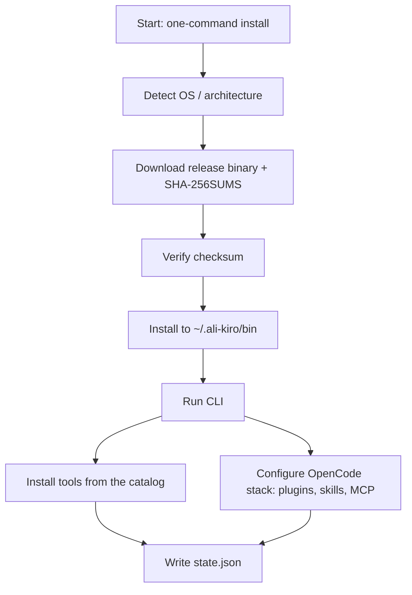

# ali-kiro — Architecture

This document describes the high-level architecture of **ali-kiro**: a
one-command, cross-platform installer and manager for AI coding assistants
(OpenCode, Claude Code, OpenAI Codex, Cursor, Aider, Gemini CLI, Antigravity
CLI), with a full OpenCode stack (configuration, plugins, skills, and MCP
server presets) bundled.

Everything below describes the design as implemented. If small details drift
from what you see in the code, treat the code as the source of truth.

## Pipeline overview

The user-facing flow, straight from the README:



1. **Environment check** — detect OS/arch, available package managers, and
   verify bundled assets integrity.
2. **AI selection** — interactive menu (TTY) or `--only`/`--skip` filters;
   defaults to all 7 tools.
3. **OpenCode full stack** — copy config, install 5 plugins with deps +
   import-smoke, copy 38 skills, sync MCP servers, restart the service.
4. **Other AI assistants** — install + verify each selected tool (OpenCode,
   Claude Code, Codex CLI, Cursor, Aider, Gemini CLI, Antigravity CLI).
5. **Verification sweep** — re-check every binary `--version`, plugin smokes,
   and the MCP list.
6. **Report + state write** — write `~/.ali-kiro/state.json` atomically.
7. **Final report** — per-tool status summary and exit code (`--dry-run`
   prints the plan without changing anything).

## Module map

```
src/
  core/       Engine: state ledger, idempotency, dry-run gating, verification,
              logging, and the plan/diff machinery.
  cli/        Argument parsing, the interactive tool selector, and report
              rendering (terminal menu + final summary).
  install/    Per-tool installers (OpenCode, Claude Code, Codex, Cursor,
              Aider, Gemini CLI, Antigravity CLI), the Node.js bootstrap
              helper, and platform helpers (POSIX + Windows).
  providers/  Knowledge about each AI tool: how to detect an existing
              installation, the install command for each OS, and the
              verification command.
  assets/     Offline, machine-portable bundle: plugins/, skills/, mcp/,
              config/ (see "Asset layout").
```

The binaries (`ali-kiro.mjs` → `ali-kiro` via `bun build --compile`) are just
the CLI entry point over the same modules — there is no separate binary logic
to maintain.

## State ledger

```
~/.ali-kiro/state.json
```

- One JSON record per managed item (tool, plugin, skill set, MCP server), with
  `status`, `version`, `installMethod`, `installedAt`, and `verified`.
- The ledger lives at `~/.ali-kiro/state.json`. `--target <dir>` redirects the
  OpenCode config install (config/plugins/skills/MCP) for portable/testing
  runs — it does not move the ledger.
- The ledger is what makes ali-kiro **idempotent**: re-running converges to
  the same state instead of duplicating installs.

## Asset layout (`src/assets/`)

```
src/assets/
  plugins/    FlowDeck, harness-memory, oh-my-opencode-slim,
              opencode-dynamic-context-pruning, opencode-snip (5 plugins)
  skills/     38 skills (19 from anthropics/skills, 2 from
              kdcokenny/opencode-workspace, 17 MiniMax suite)
  mcp/        mcp-servers.json — 10 MCP server presets (6 auto, 4 manual)
  config/     opencode.json, opencode.json.backup, cli.json, dcp.jsonc
```

- All plugin paths in the config are portable relative paths (`./plugins/...`),
  so the bundle works from any checkout location.
- `service.json`-style machine-specific/auth files are deliberately **not**
  bundled — the bundle contains no secrets (verified at bundle time).

## Exit codes

| Code | Meaning |
|------|---------|
| `0` | Everything installed/verified successfully (or a successful dry run) |
| `1` | Environment problem — OS/arch or bundled-assets check failed |
| `2` | Install failed — a tool install or the OpenCode stack did not complete |
| `3` | Verification failed — installs completed but post-install checks did not pass |
| `4` | Usage error — unknown flag, invalid `--only`/`--skip` id, missing `--target` value |

## Error and retry policy

- Each install step may retry transient failures (network timeouts, download
  interruptions) with a short backoff — bounded retries, then the step is
  marked `failed` with its reason in the ledger.
- One tool failing does **not** abort the rest of the run; the final report
  lists every failure so the user can fix and re-run (the run is idempotent,
  so re-running only touches the failed pieces).
- `--dry-run` never mutates anything — it only computes and prints the plan.
- Installer scripts (`install.sh` / `install.ps1`) prefer the prebuilt binary
  and fall back to running `node ali-kiro.mjs` from source when the binary is
  unavailable, falling back once more to bootstrapping Node.js LTS if needed.
- Failures, retries, and skipped steps are all recorded in the state ledger
  for auditability.